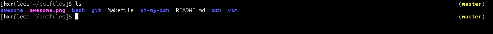

# erasche's dotfiles

Trust me, you don't want this rubbish. Managed by GNU stow, which I highly
recommend for anyone else just starting out with a dotfiles repo.

## AwesomeWM

I'm finding myself fond of it:

## ZSH

Custom ZSH theme with zero nonsense (seriously, how many symbols and weird
fonts do you hipsters need). I've waffled about even including the git status
line given that it's extra noise and 9/10 times I run `git status` before I can
even read the `(master)`.

